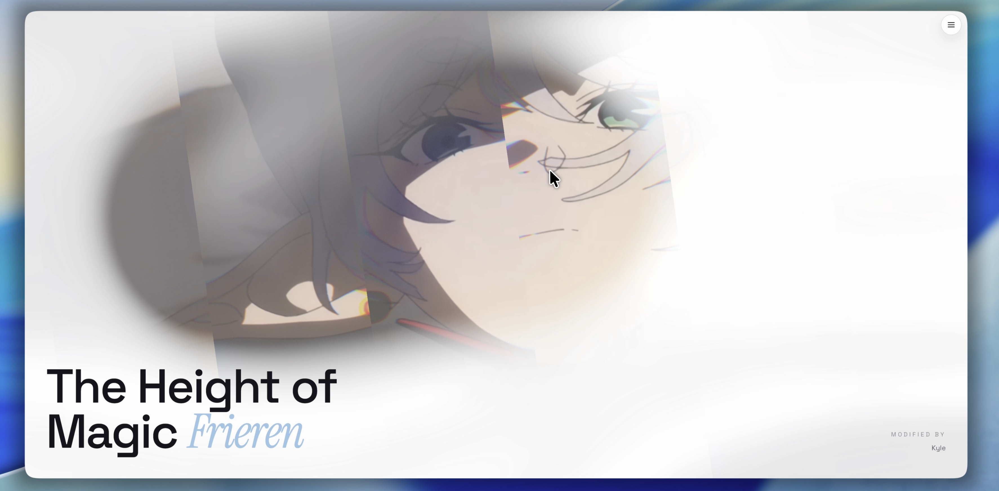

# Glasshaus - Frieren

这是一个基于 **Shader Glass Effect** （https://shaders.com/sections/glass-agency-hero） 制作的交互式 Demo 页面。页面使用 WebGPU Shader 构建玻璃质感视觉效果，并开放了大量 Glass 材质参数，方便实时调整和观察效果。



## 在线 Demo

[打开在线 Demo](https://liambommer.github.io/ShaderGlassFrieren/)

项目通过 GitHub Actions 构建，并发布到 GitHub Pages。每次推送 `main` 分支后会自动重新部署。

## 本地运行

```bash
npm install
npm run dev
```

浏览器打开终端显示的本地地址即可查看效果。

## 构建生产版本

```bash
npm run build
npm run preview
```
